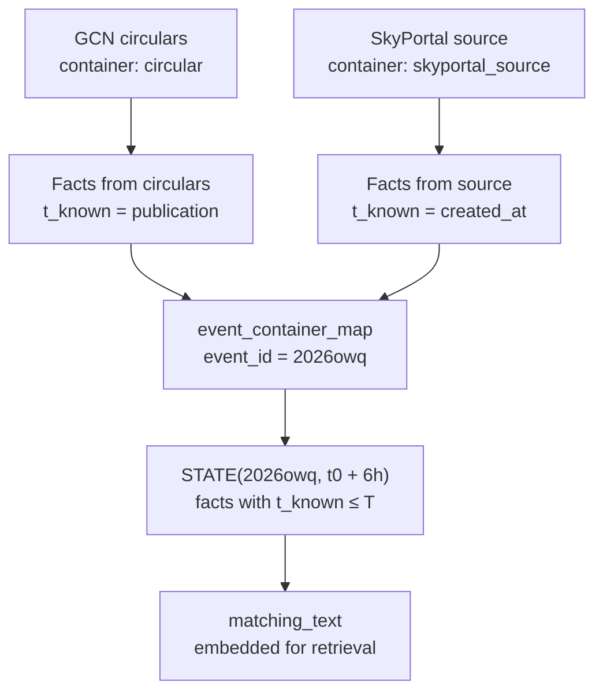

# Walkthrough: one event through the ledger

For whom: anyone who wants to see what the ledger actually contains. The data lives in
Parquet and is invisible without a query, so this document follows a single real event —
`2026owq` — from its raw containers to its reconstructed state.

All values are read from the built ledger. Nothing here is illustrative.

---

## 1. The shape of the flow

A fact never references an event. It references its **container** — one circular, or one
SkyPortal source — and the map connects containers to events. Both branches are structured
identically; what differs is how `t_known` is derived.

---

## 2. The event

| column | value |
|---|---|
| `event_id` | 2026owq |
| `t0` | 2026-06-10T23:46:14.249971+00:00 |
| `t0_source` | `skyportal_t0` |
| `t0_uncertainty_hours` | 0.0 |
| `anchor_type` | `first_detection` |
| `tier_status` | `phase_matching` |
| `name_pattern_class` | `tns_like` |
| `profiles` | `grandma_base` |
| `ra` / `dec` | 218.159414 / 27.004935 |
| `created_at` | 2026-06-11T02:21:37.079885+00:00 |
| `captured_at` | 2026-07-20T09:39:39+00:00 |
| `visibility_scope` | GRANDMA, GRANDMA/Kilonova-Catcher, Sitewide Group |

This event has a real SkyPortal `t0`, so its uncertainty is zero and it qualifies for phase
matching. Note that `anchor_type` is `first_detection`, not `trigger`: the anchor is when
the transient was first seen, which is an upper bound on the explosion time.

Also note `created_at` is 2 h 35 min after `t0`. The SkyPortal record was created after the
event was already circulating.

---

## 3. Its containers

The event maps to **31 containers**: 30 circulars and 1 SkyPortal source.

| container_type | container_id | match_method |
|---|---|---|
| circular | 44901 | `confirmed_subject_match` |
| circular | 44903 | `confirmed_subject_match` |
| circular | 44905 | `confirmed_subject_match` |
| circular | 44909 | `confirmed_subject_match` |
| … | … | … |
| skyportal_source | 2026owq | `direct` |

Every circular match carries its evidence in `match_evidence` — here the alias
`GRB 260610B`, normalised to `grb260610b`, found in the circular subject. A questionable
match can always be traced back to the term that produced it.

---

## 4. Its facts

**319 facts** attached through those containers.

| source_system | fact_type | fact_subtype | rows |
|---|---|---|---:|
| gcn | gcn_evidence | `EVENT_IDENTITY` | 103 |
| gcn | photometry | `detection` | 66 |
| skyportal | summary_version | — | 44 |
| gcn | gcn_evidence | `LIGHTCURVE_EVOLUTION` | 25 |
| gcn | gcn_evidence | `COUNTERPART_ASSOCIATION` | 22 |
| gcn | gcn_evidence | `HIGH_ENERGY_PROPERTY` | 14 |
| gcn | gcn_evidence | `SPECTROSCOPY` | 8 |
| gcn | gcn_evidence | `CLASSIFICATION_INTERPRETATION` | 7 |
| gcn | gcn_evidence | `REDSHIFT_EVENT` | 7 |
| gcn | gcn_evidence | `LOCALIZATION` | 5 |
| gcn | gcn_evidence | `TRIGGER_INSTRUMENT` | 5 |
| gcn | gcn_evidence | `TRIGGER_TIME` | 4 |
| gcn | gcn_evidence | `T90` | 2 |
| gcn | photometry | `upper_limit` | 2 |
| skyportal | redshift_version | — | 2 |
| gcn | gcn_evidence | `HOST_CONTEXT` | 1 |
| gcn | gcn_evidence | `REDSHIFT_CONTEXT` | 1 |
| skyportal | classification | — | 1 |

`EVENT_IDENTITY` dominates because every circular repeats the event name several times.
That is expected, and it is why identity facts are not used as descriptive content.

---

## 5. What a fact looks like

One complete GCN evidence fact, unabridged:

| column | value |
|---|---|
| `fact_id` | `02966bbf483175188601c3f9851e8616aa5a065d73d033822e054c1bae2556e9` |
| `fact_type` / `fact_subtype` | `gcn_evidence` / `LOCALIZATION` |
| `source_system` | `gcn` |
| `container_type` / `container_id` | `circular` / 44903 |
| `t_known` | 2026-06-11T02:49:52.775000+00:00 |
| `t_known_method` | `circular_publication` |
| `t_occurred` | null |
| `value_raw` | `RA=218.159414, Dec=27.004935` |
| `value_parsed` | `{"certainty":"confirmed","target":"event"}` |
| `parse_status` | `not_applicable` |
| `parse_note` | obs_time parsing applies to photometry only |
| `text` | `RA,DEC (J2000) = 218.159414, 27.004935, 14:32:38.26, +27:00:17.76` |
| `text_source` | `span` |
| `text_render_version` | null |
| `span_start` / `span_end` | 1566 / 1651 |
| `text_sha256` | `d67473b72021580a3d185aa5477851edbcd762db03a3609b984c76ed1933651b` |
| `extractor_id` / `extractor_version` | `localization-v1` / 0.1 |
| `rule_id` | `localization.radec_decimal_sexagesimal` |
| `method` / `confidence` | `regex` / 1.0 |
| `needs_review` | false |
| `validation_status` | `rule_extracted` |
| `captured_at` | 2026-07-25T06:43:05.158916+00:00 |

Everything needed to audit this fact is on the row. The span offsets point into circular
44903; `text_sha256` identifies the exact canonical text those offsets index into, so if
the source text ever changes the mismatch is detectable. `rule_id` names the specific rule
that fired. `validation_status` says no human has seen it yet.

The photometry columns (`band_raw`, `mag`, `is_limit`, …) are null here because this is an
evidence fact, not a measurement. They are promoted to top-level columns rather than kept
inside `value_parsed` because photometry is filtered on constantly.

---

## 6. The temporal funnel

Facts arrive over days. Truncating on `t_known` at each window gives:

| Window | Facts known | GCN | SkyPortal |
|---|---:|---:|---:|
| 6 h | **17** | 17 | **0** |
| 24 h | 92 | 82 | 10 |
| 7 d | 266 | — | — |
| Everything | 319 | — | — |

**At six hours, this event has no SkyPortal facts at all.** They first appear at 24 h. The
two-speed structure measured across the corpus is visible here in a single case.

The first facts, in the order they became knowable:

| hours since t0 | source | subtype | text |
|---:|---|---|---|
| 1.72 | gcn | `TRIGGER_TIME` | 23:46:14.25 UT on 10 June 2026 |
| 1.72 | gcn | `TRIGGER_INSTRUMENT` | Fermi GBM |
| 1.72 | gcn | `LOCALIZATION` | uncertainty of 2.77 degrees |
| 1.72 | gcn | `CLASSIFICATION_INTERPRETATION` | likely LONG GRB |
| 3.06 | gcn | `LOCALIZATION` | RA,DEC (J2000) = 218.159414, 27.004935 |
| 3.06 | gcn | `detection` | L = 16.66 ± 0.01 |
| 3.06 | gcn | `detection` | L = 17.83 ± 0.03 |
| 3.06 | gcn | `LIGHTCURVE_EVOLUTION` | fading |

Two circulars, arriving 1.7 h and 3.1 h after the trigger, carry everything known at the
six-hour mark. In those first six hours the system knows **5%** of what it will know within
a week.

---

## 7. The state at six hours

`structured_values`, the typed payload:

| field | value |
|---|---|
| `messenger_class` | High-energy transient |
| `trigger_instrument` | Fermi/GBM |
| `localization_state` | precise |
| `coarse_radius_deg` | 2.77 |
| `best_radius_arcsec` | null |
| `classification_known` | true |
| `classification_labels` | `["long GRB"]` |
| `has_counterpart` | true |
| `has_localization` | true |
| `n_detections` | 2 |
| `n_upper_limits` | 0 |
| `first_detection_band` / `mag` | L / 16.66 |
| `last_detection_band` / `mag` | L / 17.83 |
| `t90_known_at_T` | false |
| `z_known_at_T` | false |
| `dt_hours` | 6.0 |

`matching_text`, the text that gets embedded:

> High-energy transient observed at 6 h after trigger. Triggered by Fermi/GBM. Precise
> position available. Initial localisation about 2.77°. Interpreted as long GRB. An optical
> counterpart is associated. 2 detections in optical (L), magnitude 16.66 to 17.83, between
> 0.2 and 0.2 h after trigger. Light-curve evolution is reported. No redshift measured yet.
> No reported burst duration. No spectroscopy reported yet. No host-galaxy context reported
> yet.

Note that absences are stated explicitly — no redshift, no duration, no spectroscopy. What
is *not* known at a given moment is part of the state, not a gap in it.

`dossier_text` at this window is the same text preceded by a header line (449 vs 491
characters). The dossier normally adds SkyPortal content; at six hours there is none to
add.

---

## 8. The whole journey

| Stage | What exists | Count |
|---|---|---:|
| Raw circulars | mapped circular records in the archive | 30 |
| Raw SkyPortal records | comments 92, photometry 106, follow-ups 9 | 207 |
| Containers mapped | circular + source rows | 31 |
| Facts emitted | attached through the maps | 319 |
| Facts at 6 h | surviving `t_known` truncation | 17 |
| State snapshots | 6 h, 24 h, 7 d | 3 |
| Index vectors | one per window, 1024-dim float32, L2-normalised | 3 |

---

## 9. What this walkthrough exposes

**Most raw SkyPortal content is not in the ledger.** This event has 207 raw records but
contributes only a handful of SkyPortal facts. Comments and follow-up requests are not yet
emitted — the latter blocked by personal data.

**Two columns present in the data are absent from the specification.**
`t_known_confidence` (populated, `high` on this fact) and `is_canonical` (null) exist in
the Parquet files but are not listed in `01_schema_v1.md`, having been judged redundant
with `t_known_method` and with the documented precedence rule. Either the SkyPortal side is
re-emitted without them or the specification restores them; today the two disagree.

**The descriptive-fact count is not the surviving-fact count.** At 24 h, 92 facts survive
truncation but the stored descriptive count is 83: not every fact type contributes
descriptive content to the state. The filter is applied in the state layer and is not
documented here.

**`duckdb` is not installed in the environment**, although the ledger documentation
describes DuckDB as the query path. The tables above were produced with pandas and pyarrow.
Either the dependency is added or the documentation describes an intention rather than the
practice.
